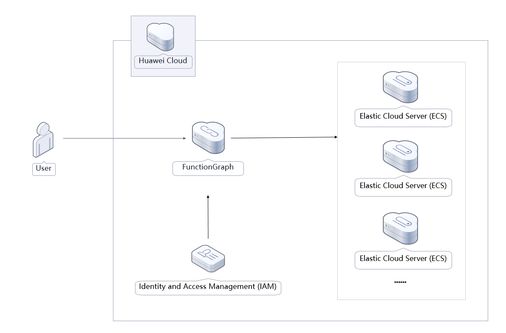
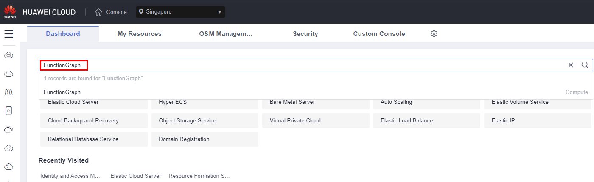
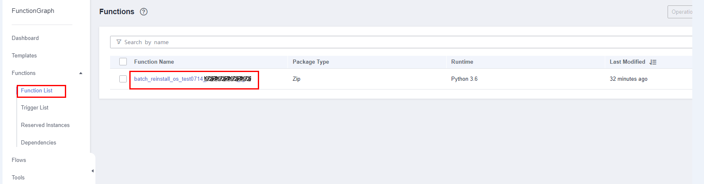
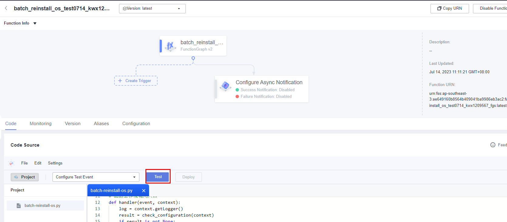
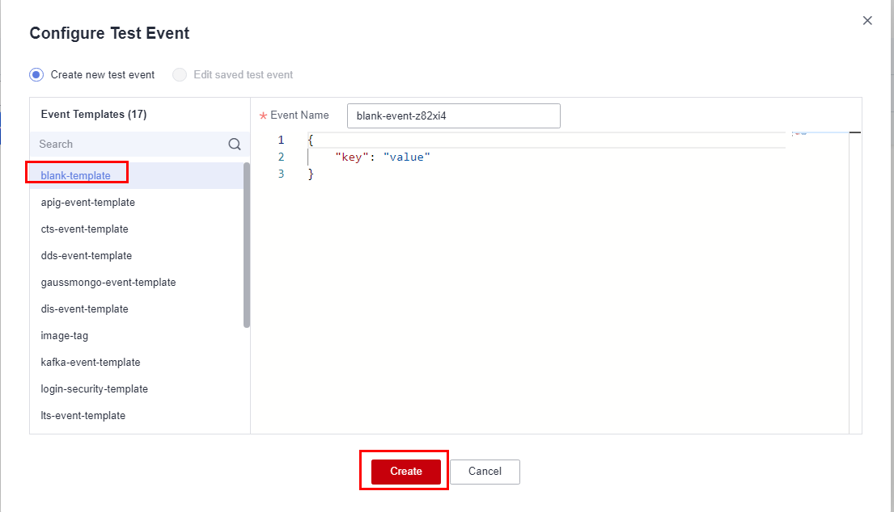
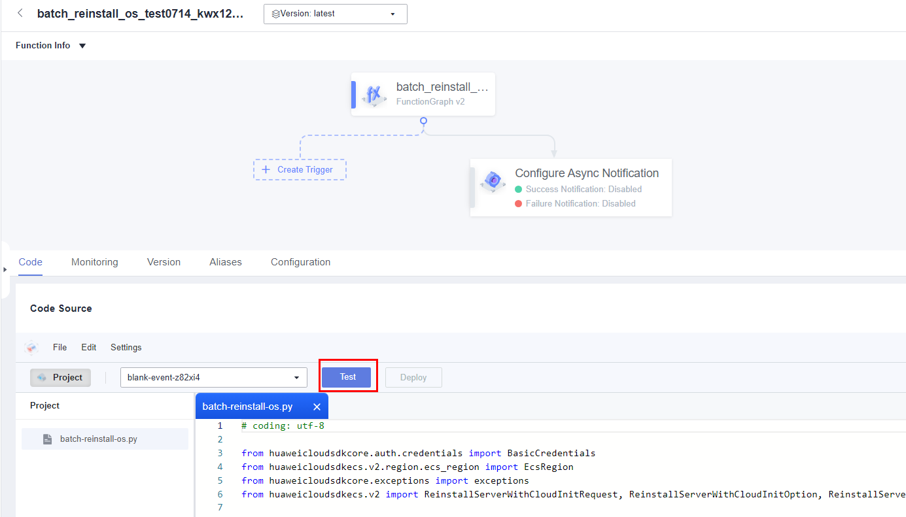
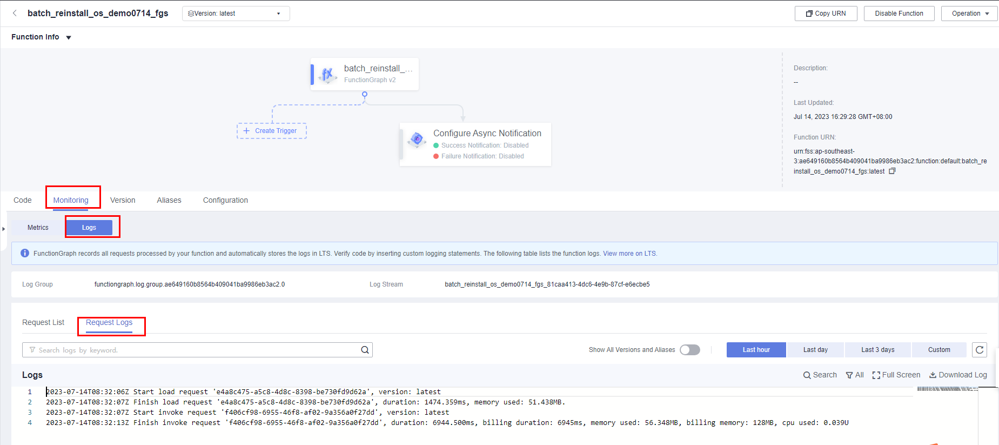
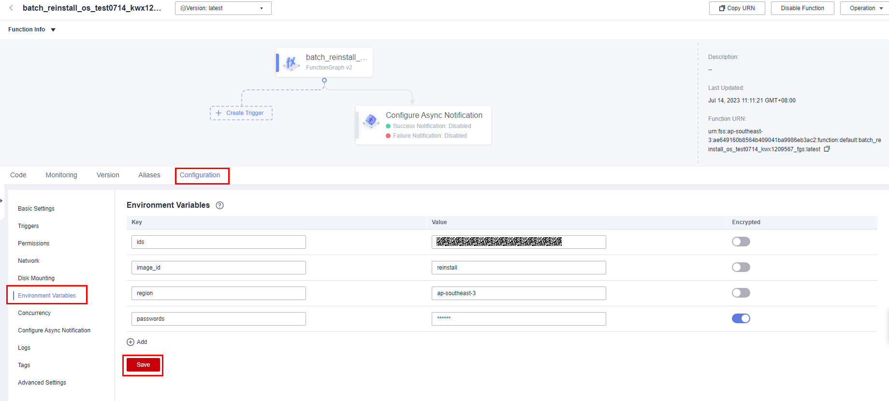

[TOC]

**解决方案介绍**
===============
该解决方案通过华为云函数工作流服务FunctionGraph的定时触发器，来帮您实现弹性云服务器 ECS批量完成定时更换或重装操作系统。

**架构图**
---------------


**架构描述**
---------------
该解决方案会部署如下资源：

1、通过华为云提供的弹性云服务器ECS的Python SDK，为函数工作流创建调用云服务器所需的函数依赖包。

2、创建函数工作流，用来调用弹性云服务器ECS的相关接口，实现重装或更新操作系统的业务逻辑。

3、创建定时触发器TIMER的计划事件功能，指定固定频率定期调用函数工作流代码，实现定期重装或更新操作系统。

4、通过统一身份认证服务的委托功能，将帐号Region内ECS的操作权限委托给函数工作流服务。

**组织结构**
---------------
``` lua
huaweicloud-solution-batch-reinstall-os-at-scheduled-time
├── batch-reinstall-os.tf.json -- 资源编排模板
├── functiongraph
    ├── batch-reinstall-os.py  -- 函数文件
```
**开始使用**
---------------
1. 登录华为云控制台，搜索FunctionGraph点击进入函数列表。

    图1 华为云控制台

    

2. 在函数列表中查看该方案创建的函数。

     图2 已创建的函数
 
     

3. 进入函数主页，单击“测试”在弹出窗口中选择“空白模板”单击“创建”配置测试事件。

    图3 函数主页

    

    图4 配置测试事件

    

4. 在函数主页，单击“测试”调用函数，实现批量重装或切换操作系统。页面右侧执行结果返回如下信息表示执行成功。

    图5 调用函数
    
    

    图6 执行成功
    
    

5. 在函数服务的监控中，可以查看已经完成重装操作系统的请求日志信息。

    图7 请求日志
    
    

6. 若有新的弹性云服务器ECS重装或者切换操作系统需求，可进入函数主页依次单击“设置"“环境变量”，在“值”输入框内填入相应的内容，单击“保存”后按照步骤4重新执行调用函数即可。

    图8 设置环境变量
    
    

