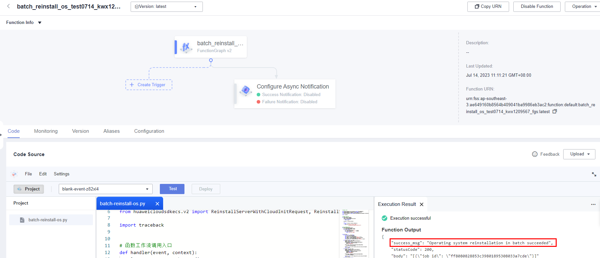

[TOC]

**Solution Overview**
===============
This solution uses a FunctionGraph timer trigger to periodically change or reinstall the OS of multiple Elastic Cloud Servers (ECSs).

**Architecture**
---------------


**Architecture Description**
---------------
This solution will:

1. Create the required function dependency with the Python SDK of ECS.

2. Create a FunctionGraph function to call the ECS API used to reinstall or change the OS.

3. Create a timer to periodically invoke the function code.

4. Create an agency in Identity and Access Management (IAM) to delegate FunctionGraph to access ECS in the relevant region.

**File Structure**
---------------
``` lua
huaweicloud-solution-batch-reinstall-os-at-scheduled-time
├── batch-reinstall-os.tf.json -- Resource orchestration template
├── functiongraph
    ├── batch-reinstall-os.py  -- Function file
```
**Getting Started**
---------------
1. Log in to the Huawei Cloud console, search for FunctionGraph, and go to the function list.

    Figure 1 Huawei Cloud console~~~~

    

2. View the function created for this solution.

    Figure 2 Created function
    
    

3. Go to the function details page, and click Test. In the displayed dialog box, select blank-template, and click Create to create a test event.

    Figure 3 Function details page
    
    

    Figure 4 Configuring a test event
    
    

4. On the function details page, click Test to invoke the function to reinstall or change the OS. If information similar to the following is returned, the execution is successful.

    Figure 5 Invoking a function
    
    

    Figure 6 Execution successful
    
    

5. On the Monitoring tab, view the request logs about OS reinstallation.

    Figure 7 Request logs
    
    

6. To reinstall or change the OS of other ECSs, go to the function details page, choose Configuration > Environment Variables, enter variable values, and click Save. Then invoke the function again by referring to Step 4.

    Figure 8 Setting environment variables
    
    
